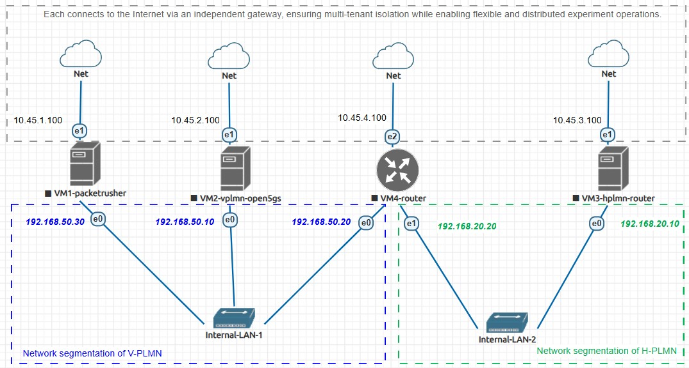

# R-5GS: A Full-Scale 5G Roaming Testbed on EVE-NG

This repository provides the reproducible implementation of **R-5GS**, a full-scale, multi-operator 5G roaming testbed based on **Open5GS** and **PacketRusher**. The testbed is designed to go beyond core-level simulation by enabling realistic, end-to-end roaming evaluation across UE, RAN, and Core Network layers. This platform serves both research and education purposes in mobile networking, security, and inter-PLMN interoperability.

## [1] Motivation

While roaming is a pivotal element in 5G system architecture, current open-source platforms fall short in fully supporting cross-PLMN evaluation. In particular:

- **Open5GS** provides only partial roaming support.
- **UERANSIM** and **OpenAirInterface** lack proper roaming-capable UE/RAN simulation.
- Most existing setups simulate only core-level roaming.

R-5GS bridges this gap by offering a full-stack roaming environment—including **UE registration, PDU session establishment, and inter-PLMN SBA signaling via N32**.

## [2] Architecture Overview

The R-5GS testbed consists of:

| VM | Role | Description |
|----|------|-------------|
| VM1 | UE/RAN | PacketRusher-based UE/gNB simulator |
| VM2 | V-PLMN | Open5GS (AMF, SMF, UPF, SEPP, etc.) |
| VM3 | H-PLMN | Open5GS (AMF, SMF, UPF, SEPP, etc.) |
| VM4 | IPX | Simulated IPX router with iproute2 |

Each VM is assigned a dedicated NAT gateway (`pnet1`–`pnet4`) to ensure isolation between different vendors.

Each PLMN is assigned a network segmentaiton(`Internal-LAN-1`-`Internal-LAN-2`) to forward 5G roaming traffic. 

## [3] Deployment Options

We provide **two deployment methods** to suit different needs:

### [3-1] Option 1: Quick Deployment (Prebuilt EVE-NG VM Export)

If you want to run the testbed immediately without rebuilding everything:

1. Download our prebuilt EVE-NG VM export from [Google Drive](https://drive.google.com/file/d/1wKQYs--OQn9XEg68P6qQnO_OdGcTWo4R/view?usp=sharing).
2. Import the `.ovf` into VMware Workstation or ESXi.
3. Boot the EVE-NG VM and log in.
4. Open the EVE-NG web GUI → Import the provided `.unl` topology.
5. Start all nodes and run the init scripts inside each VM.

----

### [3-2] Option 2: Manual Deployment (Educational & Reproducible)

If you'd like to **learn how to build the testbed from scratch** on your own EVE-NG installation:
